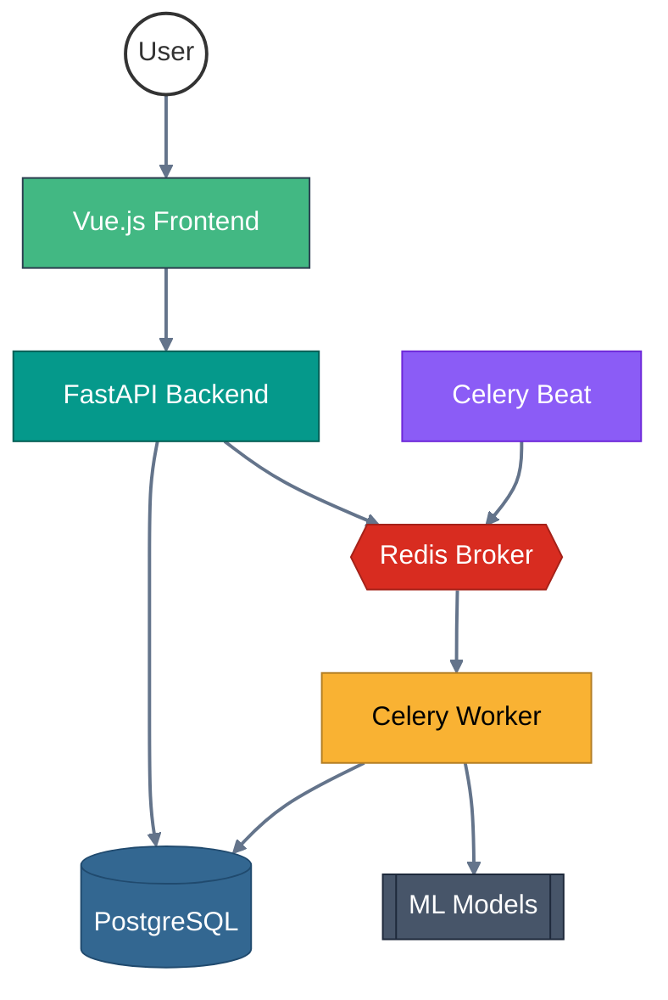

# IntellInbox: AI-Powered Email Triage

A containerized, asynchronous microservice designed to ingest, classify, and summarize emails using Natural Language Processing (NLP).

## Overview

This project addresses "information fatigue" by automatically processing incoming text/emails. Instead of a simple script, it uses a **distributed architecture** to handle heavy machine learning tasks without blocking the main application.

### Key Features

* **Asynchronous Processing:** Uses a task queue to ensure the API remains responsive while models run.
* **Priority Scoring:** Classifies emails by urgency.
* **Auto-Summarization:** Generates concise summaries of long threads.
* **Entity Tagging:** Extracts actionable metadata (dates, names, topics).
* **Full Containerization:** The entire stack is orchestrated via Docker Compose for easy deployment.

## System Architecture

The system is split into four main services to ensure scalability:

1. **FastAPI (The Gateway):** Receives raw email data and provides an interface for the user.
2. **PostgreSQL (The Brain):** Stores raw emails and links them to their AI-generated analysis.
3. **Redis (The Broker):** Manages the communication between the API and the background workers.
4. **Celery Worker (The ML Engine):** Loads the **BERT** (Classification) and **T5** (Summarization) models to process the data.
  
## Project Structure
```
intellinbox/
├── .venv/
├── frontend/
├── db/
│   ├── database.py
│   ├── models.py
│   └── security.py
├── backend/
│   ├── routes/
│   │   ├── emails.py
│   │   └── inboxes.py
│   ├── main.py
│   ├── schemas.py
│   └── Dockerfile
├── worker/
│   ├── tasks.py
│   ├── fetcher.py
│   └── Dockerfile
├── postgres_data/
├── models/
├── docker-compose.yml
├── .dockerignore
├── .env
└── requirements.txt
```



## Tech Stack

* **Backend:** Python 3.11, FastAPI
* **ML Frameworks:** Hugging Face Transformers, PyTorch
* **Database:** PostgreSQL (Relational data), Redis (Message broker)
* **DevOps:** Docker, Docker Compose
* **Task Management:** Celery

## Getting Started

### Prerequisites

* Docker & Docker Compose
* A pre-trained model directory (or let the worker download them on first boot)

### Installation

1. **Clone the repo:**
```bash
git clone https://github.com/aadium/intellinbox.git
cd intellinbox

```
2. **Spin up the infrastructure:**
```bash
docker-compose up --build

```
3. **Test the API:**
Access the interactive docs at `http://localhost:8000/docs`.
4. **Access the frontend:**
Access the frontend at `http://localhost:5173`.
